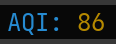

# tmux-ha-aqi

This plugin displays the AQI number in Tmux's status bar. The number is obtained from a Home Assistant server that has AirVisual integration. This way it can save a lot of API calls to AirVisual.

## Installation with [Tmux Plugin Manager](https://github.com/tmux-plugins/tpm)

Add this to `.tmux.conf`:
```
set -g @plugin 'minhdanh/tmux-ha-aqi'
```

Also add `#{aqi}` to your left/right status bar.

Then hit `<prefix> + I` to install the plugin.

### Configure

For the plugin to work properly you need an endpoint of Home Assistant and an [API token](https://developers.home-assistant.io/docs/api/rest/). AirVisual should have been integrated with Home Assistant too.
To privide the endpoint and token to the plugin, create a file in `~/.config/tmux-ha-aqi` with the following content:
```
HA_TOKEN=<Home Assistant API token>
HA_ENDPOINT=<Home Assistant endpoint, for example: https://192.168.0.2:8123>
```
Ater saving the file, the status bar should display the AQI in some seconds.

Sample output:

